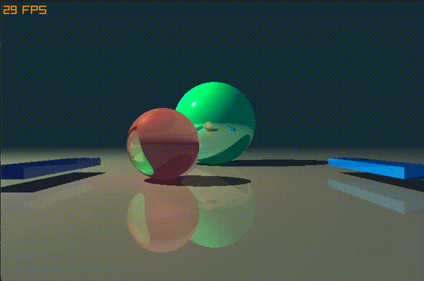

# Real Time Ray Tracing With Pong

A real time ray tracing engine, with a 3D version of Pong implemented for a demo. The gif below shows a game of Pong, with reflections, shadows, transparency, and soft lighting from emissive materials visible in the scene.

  

The engine is entirely CPU based and achieves 40 FPS on average. Use `W/S` to control the left paddle and `up/down` to control the right one.

Compile and run with `c3c build/run`. Requires Raylib to be installed for showing a window and game logic (may need to change `project.json` to link Raylib if not on MacOS).

## How It Works

To render a frame, the program first shoots a ray of light from each pixel of the screen and checks whether it hits an object. In that case, a colour from the scene's ambient light and object's base colour is calculated and another ray is sent to every light source in the scene to check if light from that source is shadowed by any other object.

If the light is not shadowed, the base colour of the object and the light source are used to add a contribution to the colour value of the pixel. Other material properties like shininess of the target and emission of the light source are also considered.

If the object was reflective/not opaque, a reflected and/or refracted ray is emitted from the intersection of the original light ray and object to recursively calculate further contributions to the pixel's colour until a maximum number of bounces is reached (or no further reflections/refractions are possible).

Since each pixel's colour can be calculated independently, the frame is split into horizontal bands and is handed to a thread pool (where the number of threads is equal to the number of cores on the CPU) so sections of the frame can be worked on in parallel, giving an approximately 4 times frame rate boost on Apple's M2 chip with 8 CPU cores compared to a single threaded engine.

Finally, the frame is dispatched to the GPU for rendering to the screen.
